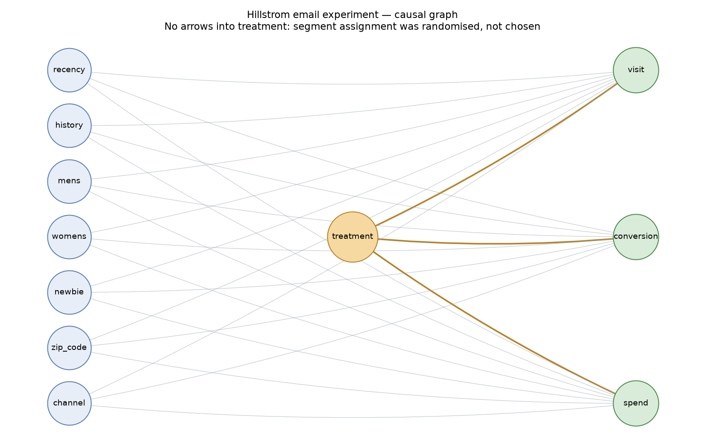
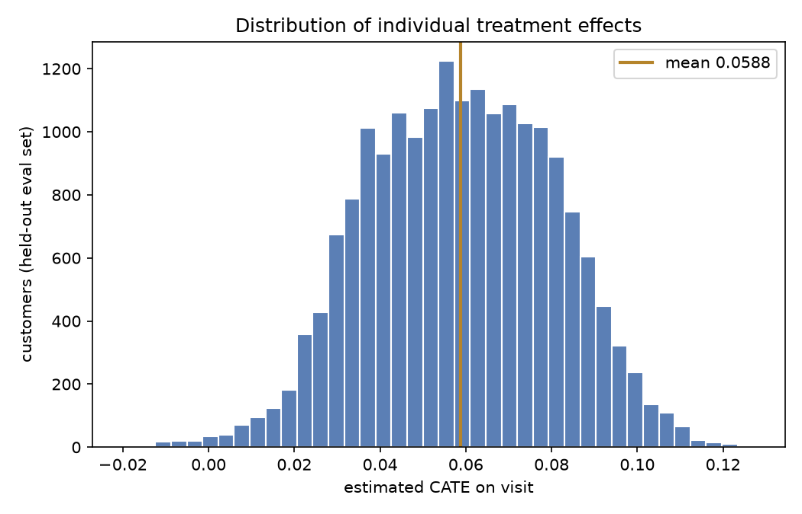
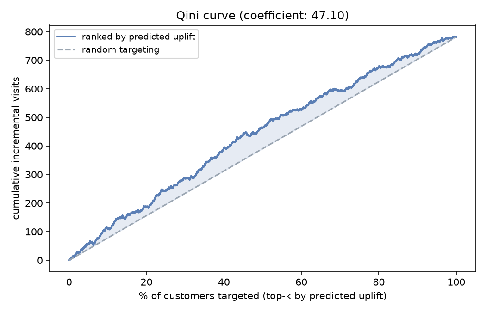

# causal-ml-uplift

[](https://github.com/Aakashanil67/causal-ml-uplift/actions/workflows/ci.yml)


Who does a marketing email actually persuade, on a real randomised experiment: DoWhy identification, EconML Double ML and causal forests, validated against a constructed confounding benchmark, refutation-tested, and shipped as an interactive what-if simulator.

**[Full report (PDF)](reports/causal_report.pdf)** · **[live simulator](https://causal-ml-uplift.streamlit.app/)** · Hillstrom e-mail experiment, 64,000 customers, three arms.



## The problem

"Customers who got the email visited more" is not the same claim as "the email caused them to visit," and most portfolio projects that use an email dataset don't distinguish the two: they report a correlation and call it insight. Hillstrom's data lets the distinction actually be tested rather than argued, because treatment was randomly assigned before the campaign ran (`reports/01_causal_question.md`), and the covariate balance check that would expose a violation of that design is run and reported, not skipped (`reports/02_naive_estimate.md`: largest standardised difference across 11 covariates is 0.0088, an order of magnitude under the usual 0.1 threshold).

The harder, more interesting problem the rest of this project is built around: does Double ML actually correct for confounding, or does it just agree with everything else because there was nothing to correct? `reports/06_confounding_benchmark.md` answers that with a number, not an assertion, by manufacturing real confounding from the same real data and checking whether DML sees through it.

## Results

Pooled treatment effect (any email vs none), `LinearDML` with LightGBM nuisance models, cross-fitted:

| outcome | DML ATE | 95% CI |
|---|---|---|
| visit | +6.01pp | [5.48, 6.55] |
| conversion | +0.50pp | [0.36, 0.64] |
| spend | +$0.613 | [0.389, 0.837] |

**Constructed confounding stress test** (`reports/06_confounding_benchmark.md`): selection on `recency`/`history` illustrates how adjustment changes an observational contrast when those covariates remain available; withholding `newbie` shows the corresponding failure mode. These are deliberately constructed scenarios, not a claim that the full-RCT estimate is the selected sample's known truth.



**Heterogeneity** (`CausalForestDML`, held-out 30% eval split): the pooled effect is not one number. It is roughly twice as large for customers with a womens-only purchase history (+0.071) as for mens-only customers (+0.043), confirmed with an OLS interaction test before trusting the forest's split, not just read off a tree.



**Targeting policy, stated honestly**: a learned three-arm `DRPolicyForest` policy (no email / mens email / womens email) scores 0.1831 on held-out data, against 0.1851 for the trivial "email everyone the mens creative" baseline — heavily overlapping confidence intervals, checked directly rather than eyeballed. The learned policy does **not** clearly beat that baseline, and the report explains why rather than picking a metric that hides it: the mens creative already has a positive effect almost everywhere, so there is little room left for per-customer targeting to improve on it (`reports/07_uplift_policy.md`).

## Methods ladder

| step | file | what it establishes |
|---|---|---|
| 1. Naive diff-in-means | `src/naive.py` | unbiased here because it's an RCT, and that claim is checked, not assumed |
| 2. Regression baseline | `src/regression_baseline.py` | logit AME / OLS, agrees with #1 as it should on an RCT |
| 3. DoWhy identification | `src/identify.py` | formal confirmation: empty backdoor set for every outcome |
| 4. LinearDML | `src/dml_ate.py` | the headline ATE, pooled and per-arm |
| 5. Confounding stress test | `src/confounded.py` | illustrates adjustment with constructed selection scenarios |
| 6. CausalForestDML | `src/cate.py` | profile-level conditional average effects, not just the average |
| 7. Qini / uplift | `src/uplift.py` | is the ranking real, and what does targeting it pay for |
| 8. Three-arm policy | `src/policy.py` | learned policy vs heuristic vs blanket-email baselines |
| 9. Refutation | `src/refute.py` | what passing placebo/random-cause/subset tests does and doesn't prove |

## How to run it

```bash
python -m venv .venv && .venv\Scripts\activate   # .venv/bin/activate on Mac/Linux
pip install -r requirements.txt
```

```bash
python -m src.data_loader          # downloads + caches data/hillstrom.csv
python -m src.naive                # reports/02_naive_estimate.md
python -m src.regression_baseline  # reports/03_regression_baseline.md
python -m src.identify             # reports/04_identification.md
python -m src.dml_ate              # reports/05_dml_ate.md
python -m src.confounded           # reports/06_confounding_benchmark.md
python -m src.cate                 # reports/figures/cate_*.png
python -m src.uplift               # reports/07_uplift_policy.md (+ Qini figure)
python -m src.policy               # appends the three-arm section to 07
python -m src.refute               # reports/08_refutations.md
python -m src.persist              # models/causal_forest.joblib
python -m src.render_report        # reports/causal_report.pdf

streamlit run app/simulator.py     # simulator at http://localhost:8501
```

Tests: `pytest -v` (79 tests; one marked `slow`, a full Streamlit `AppTest` run — `pytest -v -m "not slow"` for the fast subset). Lint: `ruff check . && ruff format --check .`. Pre-commit: `pre-commit install`.

## Design decisions and trade-offs

- **Placebo, random-common-cause and data-subset refuters are implemented by hand** (`src/refute.py`), not via DoWhy's `refute_estimate()` wrapper, because that wrapper's econml integration passes categorical effect-modifier columns straight to econml's numeric `.effect()` without dummy-encoding them and fails with a real `KeyError` on this project's `channel`/`zip_code` columns. Writing the refuters directly against `src/dml_ate.py`'s own estimator also means the *actual* model this project reports stays under test, not a substitute.
- **The confounding-benchmark's "withheld confounder" variant confounds on `newbie`, not on `recency`/`history` with one column dropped.** The first version tried the latter and it didn't produce a clean failure: `recency`, still observed, was correlated enough with the selection mechanism to partially self-correct (reproduced in `notebooks/01_exploration.ipynb`). `newbie` is close to orthogonal to the other covariates and has a standalone effect on `visit` comparable in size to the treatment effect itself, so withholding it produces a genuine, unambiguous failure worth reporting.
- **`Qini` is computed by hand** (`src/uplift.py`), not via `scikit-uplift`, so every number in the targeting-economics section can be defended line by line. Cross-checked against `sklift.metrics.qini_auc_score` in one test for sign agreement.
- **`CausalForestDML`/`DRPolicyForest` heterogeneity work targets `visit` only.** `conversion` and `spend` have 578 non-zero events total across 64,000 rows, nowhere near enough to split across a forest's leaves without the CATE surface being mostly noise (`reports/data_dictionary.md`).
- **The production model artifact (`models/causal_forest.joblib`, 34.47MB) is committed to git**, refit on the full 64,000 rows rather than the 70% split used for honest evaluation, since heterogeneity was already validated on held-out data before this refit happens. Under this project's own 50MB threshold for needing a distilled LightGBM surrogate instead, so the real forest ships.
- **`starlette` is pinned to `0.52.1`** in `requirements.txt`, one release behind Streamlit 1.61.0's own declared range. Starlette shipped a breaking 1.0 release days before this build, and its new ASGI GZip middleware crashes Streamlit's server with a real `TypeError` on the version pip resolves without the pin.

## Status

Built and tested end to end: data loader through refutations, a Streamlit simulator tested in a real browser (three real bugs found and fixed there, not just imported and assumed working), a rendered PDF report opened and paged through, CI green on GitHub, not just passing locally, and the [live deployment](https://causal-ml-uplift.streamlit.app/) itself checked in a real browser after connecting — both tabs, the Qini curve, and the three-arm policy table all confirmed rendering correctly in production. What's not done:

- **The learned three-arm policy's advantage over "email everyone the stronger creative" is not statistically established** on this eval set. A larger sample, or a campaign with genuine segment-level harm from the default action, would show the value of granular targeting more clearly than this data can.
- **The revenue-based targeting claim is underpowered** (578 non-zero spend values total): the point estimate clears the assumed per-email cost, but the confidence interval crosses zero. The report leads with the visit-based numbers, which are precise, and says this plainly rather than rounding the wide interval away.
- **One campaign, one retailer, US, March 2008.** The method generalises; the +6pp does not. `reports/causal_report.md` has a section on what would and would not transfer to a South African retention campaign.
