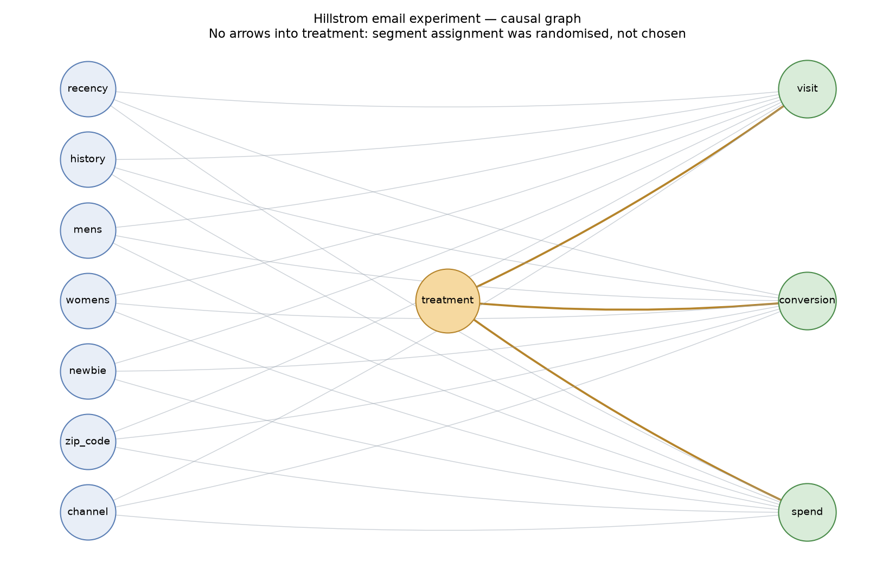

# causal-ml-uplift

[](https://github.com/Aakashanil67/causal-ml-uplift/actions/workflows/ci.yml)


Does a marketing email work equally well for every customer, and can a model pick out the customers worth emailing? This project tests both questions on Hillstrom's email experiment, where 64,000 customers were randomly split into three groups: no email, a mens email, or a womens email.

[Full report (PDF)](reports/causal_report.pdf) · [Live simulator](https://causal-ml-uplift.streamlit.app/)



## The problem

Customers who received an email visited the website more often. On its own, that does not show the email caused the extra visits. In this dataset it does, because customers were assigned to groups at random before the campaign started. The groups also look alike on the recorded customer details (`reports/02_naive_estimate.md`), which is what random assignment should produce.

The harder question is whether the effect differs enough between customers to be worth targeting. An average effect tells you the email is worth sending. It does not tell you who to send it to.

## Results

Effect of being sent either email, compared with no email. "pp" means percentage points.

| outcome | estimate (LinearDML) | 95% interval |
|---|---:|---:|
| visit | +6.01pp | [+5.48pp, +6.55pp] |
| conversion | +0.50pp | [+0.36pp, +0.64pp] |
| spend | +$0.613 | [$0.389, $0.837] |

The visit effect works out to about 60 extra visits for every 1,000 customers emailed.

Targeting is the harder part. The Qini score checks whether ranking customers by their predicted effect does better than emailing them in random order. It came out at 0.0111, with a 95% interval from -0.0114 to 0.0331. That interval includes zero, so the ranking may be no better than random order. Over five different train and test splits, the score ranged from 0.0111 to 0.0360.

I also compared five rules for deciding which email, if any, each customer gets. Each rule is scored on customers the model never saw during training:

| rule | expected visit rate | 95% interval |
|---|---:|---:|
| learned (DRPolicyForest) | 18.23% | [17.30%, 19.16%] |
| email everyone (mens creative) | 18.10% | [17.19%, 19.02%] |
| email everyone (womens creative) | 15.20% | [14.33%, 16.15%] |
| purchase-history heuristic | 18.48% | [17.51%, 19.40%] |
| email nobody | 10.70% | [9.94%, 11.51%] |

The learned rule's lead over emailing everyone the mens creative is +0.13pp, with an interval from -0.14pp to +0.40pp. The data cannot say which of the two is better. Emailing everyone the mens creative is simpler and does about as well. The highest point estimate belongs to "purchase-history heuristic", but its interval overlaps the learned rule's.

## Methods

| step | file | what it does |
|---|---|---|
| 1. Difference in means | `src/naive.py` | compares group averages, which is valid here because assignment was random |
| 2. Regression | `src/regression_baseline.py` | the same comparison, adjusted for customer details |
| 3. DoWhy identification | `src/identify.py` | confirms from the causal graph that no extra controls are needed |
| 4. LinearDML | `src/dml_ate.py` | the main average effects, overall and for each email |
| 5. Selection check | `src/confounded.py` | biases the sample on purpose to see how each method reacts |
| 6. CausalForestDML | `src/cate.py` | predicts the effect for each customer profile (exploratory) |
| 7. Qini and uplift | `src/uplift.py` | tests whether ranking customers by predicted effect beats random order |
| 8. Choosing an email | `src/policy.py` | compares the learned rule with the simple rules |
| 9. Refutation | `src/refute.py` | checks how estimates react to fake treatments, random noise and smaller samples |

Passing the refutation checks can expose problems. It does not prove an estimate is correct.

## How to run it

```powershell
py -3.12 -m venv .venv
.venv\Scripts\python.exe -m pip install -r requirements.txt
.venv\Scripts\python.exe -m streamlit run app/simulator.py
```

On macOS or Linux, use `.venv/bin/python` instead of the Windows path. The quick start uses the
model files already in the repo, so nothing needs training first.

To rebuild every estimate, figure, report, model file and the PDF, run
`.venv\Scripts\python.exe -m src.pipeline`. This includes the simulation with 500 repetitions,
so it takes a while. To run only the simulation and print its results, use
`-m src.simulation --repetitions 500`. `scripts/verify.ps1` runs the dependency check, lint and
tests.

## Design decisions

- I built two biased samples from the real data by dropping customers on purpose rather than at random. In the first, the variables behind the dropping (`recency` and `history`) stay visible to the models. In the second, the driver (`newbie`) is hidden from them. Comparing each method's estimate with the full experiment shows how it reacts in each case (`reports/06_confounding_benchmark.md`). These samples contain different customers from the full experiment, so the gaps are not exact bias measurements. Exact bias and coverage come from a separate simulated dataset where the true effect is known (`reports/07_uplift_policy.md`).
- DoWhy's own refutation wrapper failed with a `KeyError`. It passes the text columns `channel` and `zip_code` to EconML without converting them to numbers. So `src/refute.py` runs the three checks directly on the same estimator the project reports.
- The per-customer models only look at visits. Just 578 of the 64,000 customers bought anything, which is too few to split across a forest without the estimates turning into noise (`reports/data_dictionary.md`).
- The Qini curve and raw area are computed in `src/uplift.py`. The normalised score comes from scikit-uplift's `qini_auc_score` and is checked against fixed test cases.
- The simulator's model (`models/causal_forest.joblib`, 34.47 MB) is committed to git so Streamlit Cloud can load it without retraining. It is refit on all 64,000 rows. The evaluation numbers above come from earlier fits on part of the data, scored on customers held back from training. I set a 50 MB limit, above which a smaller substitute model would have replaced it.
- `starlette` is pinned to 0.52.1. Its 1.0 release came out days before this build and crashed Streamlit 1.61.0's server with a `TypeError`.

## What this does not show

The average effect is solid because the experiment was randomised. The customer ranking may be no better than random order. The learned rule has no clear lead over emailing everyone the mens creative.

Emailing the top 30% of customers gave reported spend of $0.78 per targeted
customer, with an interval from $0.37 to $1.27. The data has no
profit margins, and 12 customers sit at the $499 spend maximum, which may be a cap. So this is not
a profit figure.

The data comes from one US retailer in March 2008. The method carries over to other campaigns,
but the effect sizes do not. A South African bank or telecoms campaign in 2026 would need its own
experiment.
