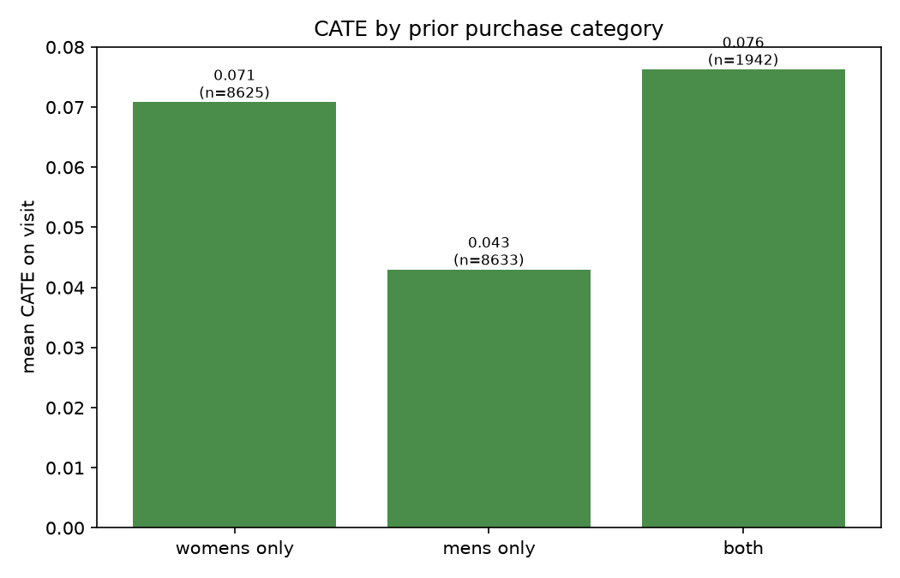

# Causal ML: what actually works?

## Estimating who a marketing email persuades, on a randomised experiment, validated against a known benchmark and refutation-tested

Does sending a customer a marketing email cause them to visit the site, or would they have done so anyway? On Hillstrom's 64,000-customer e-mail experiment (MineThatData, March 2008), the answer does not need to be hedged the usual way, because the comparison group was not estimated, it was built: customers were split at random into three arms (No E-Mail, 21,306; Mens E-Mail, 21,307; Womens E-Mail, 21,387) before the campaign ran. The headline result, defended across the rest of this report rather than just stated here: pooling both email arms lifts the two-week visit rate by 6.01 percentage points (95% CI [5.48, 6.55]), the effect is not the same for everyone (it runs from roughly −2pp to +13pp depending on the customer), and it is closer to twice as large for customers with a womens-only purchase history as for mens-only customers. A learned three-arm targeting policy beats naive heuristics but, honestly, does not clearly beat the simplest baseline of emailing everyone the stronger creative. Both findings are stated with the confidence they earn, not the confidence that would make a better slide.

## 1. The causal question and why identification is clean here

The graph this report works from (`reports/01_causal_question.md`, `reports/figures/dag.png`) has exactly one substantive property: nothing points into `treatment`. Seven covariates plausibly cause the outcomes (`recency`, `history`, `mens`, `womens`, `newbie`, `zip_code`, `channel`), but none of them caused which arm a customer landed in, because assignment was randomised. That is not a modelling assumption; it is a design fact about how Hillstrom ran the experiment, and Section 2 checks it against the data rather than taking it on faith. DoWhy's `identify_effect()` confirms the formal consequence: the backdoor adjustment set is empty for all three outcomes (`reports/04_identification.md`), so `E[Y|T=1] − E[Y|T=0]` is already the correct nonparametric estimand, no covariate adjustment required.

## 2. The naive estimate, and the check that it is allowed to be naive

Standardised covariate differences between treated and control, across 11 covariates (numeric, binary, and one row per categorical level), max out at 0.0088 (`reports/02_naive_estimate.md`), an order of magnitude under the usual 0.1 "balanced" threshold. That is the empirical version of Section 1's graph-level claim. On that basis, the naive difference-in-means is a legitimate estimate, not a strawman: +6.09pp on visit (95% CI [5.54, 6.63]), +0.50pp on conversion, +$0.597 on spend.

## 3. The methods ladder: naive, regression, and Double ML agree

| method | visit | conversion | spend |
|---|---|---|---|
| naive diff-in-means | +6.09pp [5.54, 6.63] | +0.50pp | +$0.597 |
| logit AME / OLS, covariate-adjusted | +6.49pp [5.87, 7.10] | +0.56pp [0.38, 0.75] | +$0.596 [0.375, 0.816] |
| LinearDML (LightGBM nuisances) | +6.01pp [5.48, 6.55] | +0.50pp [0.36, 0.64] | +$0.613 [0.389, 0.837] |

All three land within a few hundredths of a percentage point of each other on every outcome (`reports/03_regression_baseline.md`, `reports/05_dml_ate.md`). That agreement is not a coincidence and not a demonstration of DML's power. On a randomised experiment there is nothing for covariate adjustment or partialling-out to correct, so every unbiased method should converge on roughly the same number, and here they do. DML earns its place in the ladder for a different reason: the same partialling-out machinery is what Section 5 reuses to estimate an effect that varies by customer, which none of the simpler methods above can do at all.

Splitting the pooled treatment by creative rather than averaging it away shows the two emails are not interchangeable: mens email lifts visit by +7.47pp (DML, [6.82, 8.12]), womens by +4.49pp ([3.87, 5.12]), a real, non-overlapping gap that motivates Sections 6 and 7.

## 4. Validating DML against a known truth, not just running it

Every method above agreed because there was nothing to disagree about. `reports/06_confounding_benchmark.md` manufactures real confounding from the same real rows, retaining customers by a probability that depends on both their arm and their covariates and never fabricating an outcome, then checks whether each estimator can see through it, against the actual DML benchmark of +6.01pp.

**Confound on `recency`/`history`, both observed by every estimator:** naive diff-in-means overstates the effect by two-thirds (+10.03pp), OLS and DML both correct back to +5.93pp and +5.99pp respectively, the latter's CI [4.79, 7.19] comfortably containing the true benchmark. DoWhy's identification on the equivalent confounded graph confirms this is not a coincidence: adding `recency`/`history → treatment` edges changes the backdoor set from empty to exactly `{recency, history}`, precisely what both estimators condition on.

**Confound on `newbie`, withheld from every estimator:** naive +9.56pp, OLS +10.09pp, DML +9.49pp with a CI of [8.72, 10.26], nowhere near the true benchmark. DML does not fix confounding it cannot see. This is the honest version of "does DML work" that this report can actually stand behind: it corrects for what it is given, and no method here, or anywhere, corrects for what it was never told about.

## 5. Heterogeneity: who the email actually helps

Individual effects come from a `CausalForestDML` fit on a 70% train split, evaluated only on the held-out 30% (`src/cate.py`; see `reports/data_dictionary.md` for why this targets `visit` specifically: `conversion` and `spend` have 578 events total across 64,000 rows, nowhere near enough to split across a forest without the surface being mostly noise). Mean CATE on the eval set: +0.0588, close to the pooled DML benchmark, with real spread: std 0.0218, range roughly −0.02 to +0.13.

The headline segmentation is prior purchase category, not recency or history, confirmed with an OLS interaction test before trusting the forest's split (treatment × `womens` p<0.001, treatment × `mens` p=0.006, both real; treatment × `recency`/`history`, checked for Section 4's confounding construction, both p>0.11, not significant):

| prior purchase | mean CATE | n (eval set) |
|---|---|---|
| womens only | +0.071 | 8,625 |
| mens only | +0.043 | 8,633 |
| both | +0.076 | 1,942 |

The pooled email works for almost everyone in this data, but nearly twice as strongly for womens-purchase customers as for mens-only customers, the segmentation that Section 7's policy work has to justify improving on.

## 6. Uplift ranking and targeting economics

Ranking the eval set by predicted CATE and computing the Qini gain by hand (Radcliffe & Surry 2011 definition, cross-checked against `sklift.metrics.qini_auc_score` for sign agreement) gives a Qini coefficient of 47.10: positive, meaning the ranking beats emailing customers in a random order. Uplift deciles are not perfectly monotonic (roughly 1,920 customers per decile and a rare binary outcome means real sampling noise at that granularity), but the top two deciles average +0.0736 observed uplift against +0.0404 for the bottom two, the gradient the ranking predicts (`reports/07_uplift_policy.md`).

Targeting the top 30% by predicted uplift is expected to generate +0.0499 incremental visits per customer emailed. The equivalent revenue number, using the same visit-based ranking since there is not enough spend data for a separate spend-CATE model, has a point estimate of $0.1196 per email against an assumed $0.10 cost, but a bootstrap 95% CI of [−$0.48, $0.63] that crosses zero. This report leads with the visit numbers, which are precise, and states plainly that the revenue claim cannot be statistically distinguished from a loss at this sample size (578 non-zero spend values total). That is the anticipated risk of a sparse economic outcome, not a result hidden after the fact.

## 7. Three actions, not two: an honest result

The mens and womens creatives are different treatments, so `econml.policy.DRPolicyForest` was fit to recommend one of three actions per customer (no email, mens email, or womens email) and scored against three baselines by inverse-propensity weighting on the real held-out arms (`reports/07_uplift_policy.md`):

| policy | expected visit rate | 95% CI |
|---|---|---|
| learned (DRPolicyForest) | 0.1831 | [0.1736, 0.1941] |
| email everyone (mens creative) | 0.1851 | [0.1752, 0.1957] |
| purchase-history heuristic | 0.1756 | [0.1662, 0.1852] |
| email nobody | 0.1061 | [0.0984, 0.1137] |

`Email nobody` recovers the true control rate almost exactly (0.1061 vs 0.1062), the sanity check that the IPW estimator itself is unbiased. The learned policy does **not** clearly beat blanket mens-emailing: heavily overlapping confidence intervals, checked directly rather than eyeballed, though both comfortably and significantly beat the purchase-history heuristic and email-nobody. This is explicable, not disappointing. Section 5 showed the mens creative has a positive effect for almost every segment, including mens-only-purchase customers (+0.043, still clearly positive), so there is little headroom left for a smarter per-customer policy to improve on "send the stronger creative to everyone." The value of granular targeting would show up far more clearly in a setting where some segment is actually hurt by the default action, which is not the case here. What the learned policy does earn its place doing is this: it correctly identifies that the purchase-history heuristic's core assumption, match the creative to what the customer already buys, is wrong on this data, underperforming blanket mens-emailing by 0.0095 points of visit rate.

## 8. Refutation tests, and what they do not prove

DoWhy's own `refute_estimate()` wrapper fails outright on this project's categorical covariates (a real `KeyError`, confirmed before abandoning the approach), so placebo treatment, random common cause, and data-subset refutation were implemented by hand against the actual `LinearDML` pipeline this report uses, not a substitute (`reports/08_refutations.md`). On the real RCT, all three pass cleanly: shuffling treatment kills the effect (+0.0003, CI containing 0), adding pure random noise barely moves the estimate (+0.0605 vs +0.0601), and five refits on 80% subsamples stay tight (std 0.0015).

The more useful result comes from running the same three refuters on Section 4's already-known-biased confounded estimate (+0.0949, confirmed wrong). All three "pass" there too: placebo still shows a CI containing zero, random common cause still barely moves the (wrong) number, the subset refits are still stable, just stably wrong. None of these three standard refutation tests can detect omitted-variable bias; they test whether the estimation procedure is well-behaved, not whether the identification assumption holds. The only thing in this project that actually tested the identification assumption was Section 4's comparison against a known experimental benchmark, because that is the one place a ground truth existed to check against. Most real observational studies do not have that luxury.

## 9. Limitations, stated rather than buried

- **One campaign, one retailer, US, March 2008.** Nothing here says these exact numbers generalise to another retailer, another country, or another decade. What generalises is the method (the identify-estimate-refute-validate loop this report runs), not the +6pp.
- **`spend` is right-censored at exactly $499.00** for 12 customers, confirmed as a real cap (a gap to the next-highest value, $482.31) rather than coincidence (`reports/data_dictionary.md`). Every spend-based number in this report is a lower bound on the true effect, not an unbiased estimate.
- **The DAG treats `visit`/`conversion`/`spend` as three parallel outcomes**, not the real mediation chain (`treatment → visit → conversion → spend`, which the data supports: conversion is a strict subset of visit). This report estimates the total effect of treatment on each outcome, which is standard and matches what DML/CausalForestDML compute; it does not decompose how much of the spend effect runs through visiting, which would need its own identification argument.
- **The confounding validation in Section 4 tests selection on named, engineered covariates.** It shows DML corrects for confounding it can see and fails honestly on confounding it cannot. It says nothing about whether an unobserved confounder exists in the real, unconfounded Hillstrom data; the entire reason this project uses a randomised experiment is that it does not need to answer that question.
- **The revenue-based targeting claim (Section 6) is underpowered**, and this report says so rather than rounding the wide interval away.
- **The learned three-arm policy's advantage over the simplest baseline is not statistically established** on this eval set (Section 7). A larger eval sample, or a setting with real segment-level harm from the default action, would be needed to see policy learning's value more clearly than this data can show it.

## 10. What would and would not transfer to a South African retention campaign

The mechanics transfer directly: a bank or telco running a retention-offer RCT could rerun this exact pipeline (naive check, DoWhy identification, DML ATE, CausalForestDML heterogeneity, Qini-based targeting, a constructed confounding benchmark if a historical observational dataset exists alongside the RCT, and the same three refutation tests with the same honest caveat about what they do not prove). The specific numbers would not transfer: US speciality-retail purchase behaviour in 2008 says nothing about SA retail-bank or telco customers in 2026, and a resend-the-stronger-offer-to-everyone baseline being hard to beat is a property of *this* campaign's effect distribution (positive almost everywhere), not a general law. A SA campaign with genuine segment-level harm (an offer that actively annoys a segment into churning, for instance) is exactly the setting where Section 7's targeting would show a measurable advantage over a blanket policy, rather than the theoretical one it shows here. Finding out which case a real SA campaign is in is itself the deliverable a decision-science team would be hired to produce.

## Closing

Using Double Machine Learning to estimate heterogeneous treatment effects, and validating that estimation against a constructed benchmark before trusting it on a question without one, is the general version of what Section 4 does with `recency`/`history`/`newbie`. That is the shape of a thesis-length question worth asking about a real emerging-market intervention: not "does the policy work on average" but "for whom does it work, how would we know if our method could tell the difference, and what happens to the recommended policy once the default action itself is worth being smarter than."

---

**Repository**: [github.com/Aakashanil67/causal-ml-uplift](https://github.com/Aakashanil67/causal-ml-uplift) · **Live simulator**: see README · **Full reports**: `reports/01` through `reports/08`, this document synthesises all of them; none of the numbers above are restated from memory, each is sourced to the report that first computed it.
